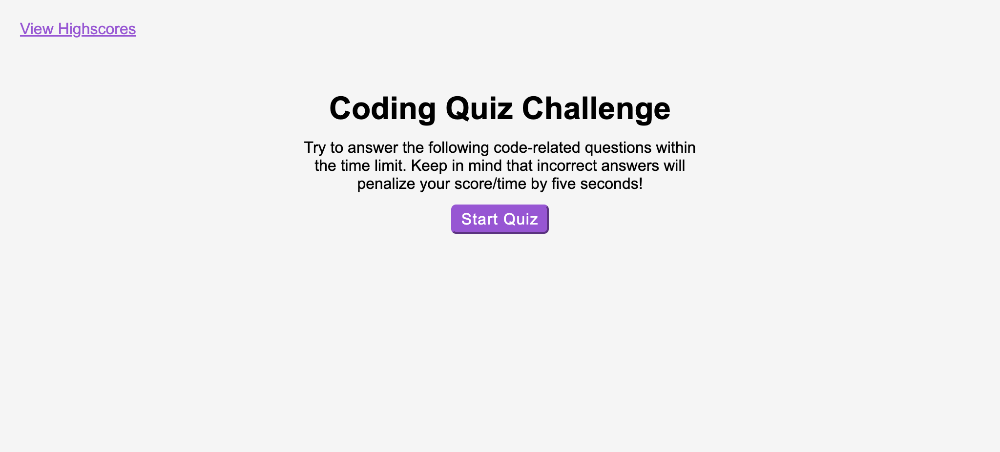
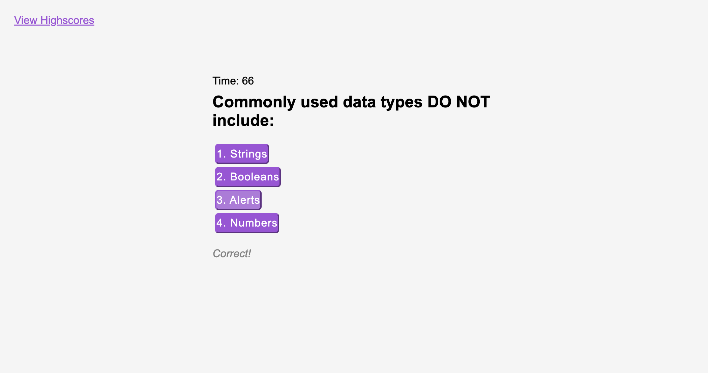
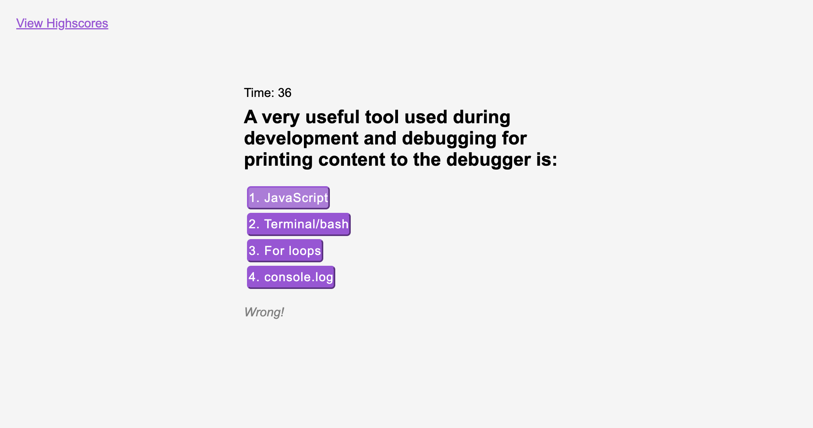
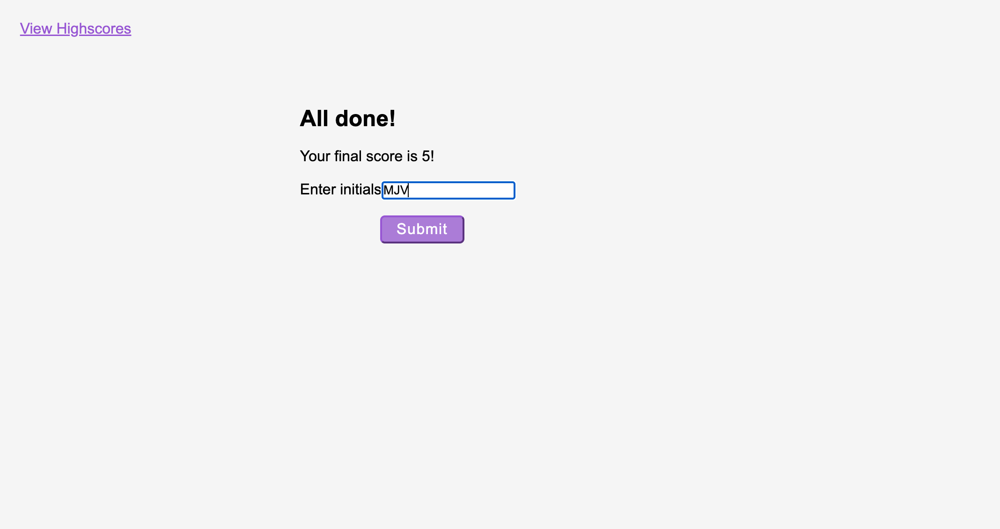
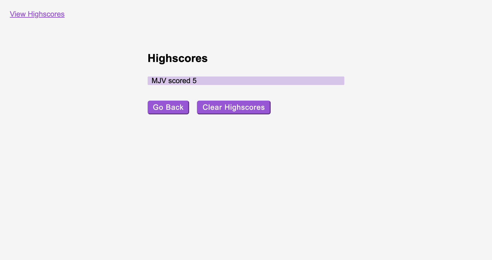

# Test-Your-Knowledge

Can you pass this test?

# Description 

This is a 5 question quiz where you have 75 seconds to finish. Each wrong answer you choose removes 5 seconds from your time. Response text will appear below the answer choices to let you know if you have choosen the correct or wrong answer. If the correct answer is choosen then you will move forward to the next question. Once all 5 questions have been answered or when the time runs out you will be directed to the score page where you can enter you're initials to be added to the highscore list. Once you click on the submit button you are directed to the highscore page where your initials and score are displayed. From this page you can either click on the clear highscores button so the list is emptied or you can click on the go back button to navigate to the introduction page and start the quiz again.

# Screenshots

# Links

GitHub Repository - https://github.com/Meljska-Fawn/test-your-knowledge

Website - https://meljska-fawn.github.io/test-your-knowledge/

# Credit

I would like to give credit to YouTube, my tutor Alistar Rowden, some classmates, and some local coding friends. 
